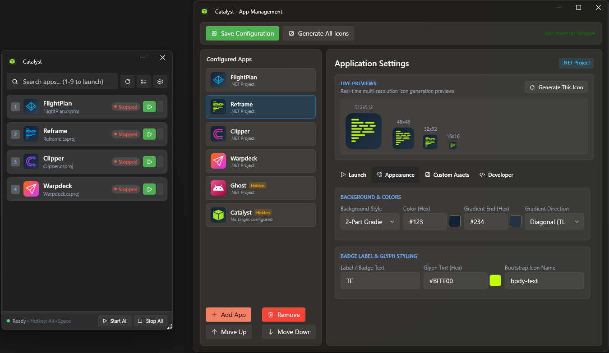

# Catalyst

> **Modern, lightweight developer project toolbox, application dashboard, and quick launcher for Windows.**

[](https://github.com/ARmunro/catalyst/actions/workflows/release.yml)
[](https://dotnet.microsoft.com/)
[](https://wpfui.lepo.co/)
[](https://microsoft.com)
[](LICENSE)

Catalyst is an overlay launcher designed for software developers and power users. It streamlines launching, supervising, and managing multi-project workspaces, microservices, developer tools, scripts, and URLs from a single unobtrusive interface.



---

## Features

### 🚀 Unified Project & Tool Launcher
- **.NET Solutions & Projects**: Launch `.csproj` and `.sln` files directly using `dotnet run`, complete with custom arguments and working directories.
- **Native Binaries & CLI Tools**: Run `.exe` executables with optional elevated permissions (**Run as Administrator**).
- **Scripts & Commands**: Execute batch scripts (`.bat`, `.cmd`) and PowerShell scripts (`.ps1`) seamlessly.
- **Web Applications & URLs**: Open web projects, dashboards, or documentation in your default browser.
- **Windows Shortcuts**: Launch `.lnk` shortcuts with target resolution.

### ⚡ Process Management & Supervision
- **Real-Time Status Tracking**: Instantly see which apps and services are active.
- **Process Tree Termination**: Cleanly stop running processes and all spawned child processes.
- **Bulk Lifecycle Controls**: Launch or stop all configured applications simultaneously via **Start All** and **Stop All** actions.
- **Live Output Log Viewer**: Built-in streaming log viewer for process standard output and standard error with auto-scrolling, live search filtering, and buffer management.

### 🎨 Icon & Favicon Studio
- **Dynamic Icon Generation**: Powered by [SkiaSharp](https://github.com/mono/SkiaSharp) and [Svg.Skia](https://github.com/wieslawsoltes/Svg.Skia), generating 512×512 PNGs, high-resolution vector SVGs, multi-resolution favicons (16×16, 32×32, 48×48), and combined `.ico` binaries.
- **Custom Visual Styles**:
  - **Backgrounds**: Solid colors or linear gradients (`Diagonal`, `DiagonalUp`, `Vertical`, `Horizontal`).
  - **Glyphs & Badges**: Choose from Bootstrap Icons, custom SVG path definitions, or 1–3 letter monogram text labels.
- **Automated Project Favicon Sync**: Copy generated icons directly into target project folders and automatically update `.csproj` `<ApplicationIcon>` and `<Resource>` entries.
- **Built-in Color Picker**: Interactive palette and hex color picker with preset support.

### ⌨️ Keyboard-First Workflow & Overlay
- **Global Summon Hotkey**: Toggle the launcher anywhere with `Alt+Space` (customizable with intelligent conflict fallbacks like `Ctrl+Shift+Space` or `Ctrl+Alt+Space`).
- **Quick-Launch Index Keys**: Press `1`–`9` (or `Alt+1`–`9`) to immediately start or toggle apps.
- **Fast Live Search**: Type to instantly filter applications by name, target path, or launch command.
- **Drag-and-Drop & Keyboard Reordering**: Reorder apps with intuitive drag-and-drop or `Alt+Up` / `Alt+Down` shortcuts.
- **System Tray Integration**: Background minimize, quick menu commands, and system notifications.

### ⚙️ Declarative YAML Configuration
- Human-readable `apps.yaml` configuration file.
- Tolerant deserializer supporting `camelCase`, `snake_case`, `PascalCase`, and `kebab-case`.
- Custom configuration path selection via CLI arguments, environment variables (`CATALYST_CONFIG`), or user settings.

---

## Architecture

Catalyst is engineered following **Hexagonal Architecture** (Ports and Adapters) to ensure testability, separation of concerns, and clean boundaries:

```
Catalyst/
├── Core/
│   ├── Domain/Models/           # Domain entities (AppInfo, UserSettings, Enums)
│   ├── Ports/
│   │   ├── Inbound/             # Application services interfaces (IAppLauncherService, IIconManagementService, ...)
│   │   └── Outbound/            # Infrastructure interfaces (IConfigRepository, IProcessExecutor, IIconRenderer, ...)
│   └── Services/                # Core domain orchestration services
├── Adapters/
│   ├── Icons/                   # SkiaSharp icon & favicon renderer implementation
│   ├── Persistence/             # YamlDotNet repository & JSON user settings storage
│   ├── Platform/                # Win32 global hotkeys and window placement
│   ├── Processes/               # Windows process execution & process tree manager
│   └── UI/                      # Navigation and MVVM ViewModels
├── Windows/                     # WPF UI Views styled with WPF-UI Fluent Design
├── DependencyInjection/         # Service registration & DI container setup
└── Catalyst.Tests/              # Comprehensive xUnit test suite (65+ unit & integration tests)
```

---

## Getting Started

### Prerequisites
- **Windows 10 / 11 (64-bit)**
- **[.NET 9.0 Runtime](https://dotnet.microsoft.com/download/dotnet/9.0)** (or self-contained build)
- **[.NET 9.0 SDK](https://dotnet.microsoft.com/download/dotnet/9.0)** (for building from source)

### Installation

#### Pre-built Binaries
Download the latest pre-packaged release from the [GitHub Releases](https://github.com/ARmunro/catalyst/releases) page:
- **`Catalyst-vX.Y.Z-win-x64.exe`**: Self-contained single-file portable executable (no .NET installation required).
- **`Catalyst-vX.Y.Z-win-x64.zip`**: Full portable application directory.

#### Building from Source
```powershell
# Clone the repository
git clone https://github.com/ARmunro/catalyst.git
cd catalyst

# Restore dependencies
dotnet restore catalyst.sln

# Build solution
dotnet build catalyst.sln -c Release

# Run application
dotnet run --project Catalyst/Catalyst.csproj
```

#### Publishing Self-Contained Executable
```powershell
dotnet publish Catalyst/Catalyst.csproj -c Release -r win-x64 --self-contained true -p:PublishSingleFile=true -p:IncludeNativeLibrariesForSelfExtract=true -p:EnableCompressionInSingleFile=true -o ./publish
```

---

## Configuration Guide (`apps.yaml`)

Catalyst loads its application registry from `apps.yaml`. By default, Catalyst looks for `apps.yaml` in the active working directory, user profile directory, or via CLI flags.

### Example `apps.yaml`
```yaml
hotkey: Alt+Space

apps:
  # .NET Application (executed with `dotnet run --project`)
  - name: FlightPlan
    hidden: false
    launch:
      projectPath: src/FlightPlan/FlightPlan.csproj
      arguments: --environment Development
      workingDirectory: src/FlightPlan
      runAsAdmin: false
    icon:
      color: "#1E88E4"
      secondaryColor: "#0D47A1"
      backgroundType: Gradient
      gradientDirection: Diagonal
      bootstrapIcon: send
      faviconPath: src/FlightPlan/favicon.ico

  # Native Executable
  - name: Redis CLI
    launch:
      executablePath: C:\Program Files\Redis\redis-cli.exe
      arguments: -p 6379
    icon:
      color: "#D32F2F"
      label: RC

  # PowerShell / Batch Script
  - name: Start Services
    launch:
      projectPath: scripts/start-environment.ps1
    icon:
      color: "#2E7D32"
      bootstrapIcon: terminal

  # Web Dashboard / URL
  - name: API Documentation
    launch:
      executablePath: https://localhost:5001/swagger
    icon:
      color: "#F57C00"
      bootstrapIcon: globe
```

### Configuration Schema Reference

#### Root Options
| Field | Type | Default | Description |
|---|---|---|---|
| `hotkey` | `string` | `Alt+Space` | Global hotkey to summon the Catalyst overlay. |
| `apps` | `list` | `[]` | List of configured application entries. |

#### App Entry (`apps[]`)
| Field | Type | Default | Description |
|---|---|---|---|
| `name` | `string` | `""` | Display name of the application. |
| `hidden` | `bool` | `false` | Whether to hide this app from the main launcher overlay. |
| `catalystDirectory` | `string` | `""` | Path to the `.catalyst` directory for project repository branding/settings export. |
| `launch` | `object` | `{}` | Launch configuration settings. |
| `icon` | `object` | `{}` | Icon customization and styling settings. |

#### Launch Options (`apps[].launch`)
| Field | Type | Default | Description |
|---|---|---|---|
| `projectPath` | `string` | `""` | Path to `.csproj`, `.sln`, `.bat`, `.cmd`, `.ps1`, or `.lnk` file. |
| `executablePath` | `string` | `""` | Direct path to executable binary (`.exe`) or web URL (`http://`, `https://`). |
| `arguments` | `string` | `""` | Command-line arguments passed when launching the process. |
| `workingDirectory` | `string` | `""` | Working directory for the process (relative paths resolve against config root). |
| `runAsAdmin` | `bool` | `false` | When `true`, prompts for UAC elevation to run as Administrator. |

#### Icon Options (`apps[].icon`)
| Field | Type | Default | Description |
|---|---|---|---|
| `color` | `string` | `#1E88E4` | Primary background color (hex string, e.g. `#007ACC`). |
| `secondaryColor` | `string` | `""` | Secondary background color used when `backgroundType` is `Gradient`. |
| `backgroundType` | `string` | `Solid` | Background style: `Solid` or `Gradient`. |
| `gradientDirection` | `string` | `Diagonal` | Gradient orientation: `Diagonal`, `DiagonalUp`, `Vertical`, or `Horizontal`. |
| `bootstrapIcon` | `string` | `""` | Bootstrap Icon name (e.g. `terminal`, `globe`, `box`, `cpu`, `database`). |
| `customGlyphSvg` | `string` | `""` | Custom SVG `<path d="..." />` or raw SVG geometry for custom vector glyphs. |
| `customGlyphColor` | `string` | `""` | Hex color code used to fill the custom vector glyph. |
| `svgOverride` | `string` | `""` | Full SVG XML string to replace the generated icon entirely. |
| `label` | `string` | `""` | 1–3 letter text monogram label displayed in center of the tile. |
| `iconPath` | `string` | `""` | Path to an existing custom image file (`.png`, `.ico`, `.svg`). |
| `faviconPath` | `string` | `""` | Target project path where generated `.ico` / `.png` / `.svg` files are synchronized. |

---

## Keyboard Shortcuts

| Shortcut | Context | Action |
|---|---|---|
| `Alt+Space` | **Global** | Toggle / summon Catalyst window from any application. |
| `1` – `9` / `Alt+1`–`9` | **Main Window** | Start or toggle the application at index 1 through 9. |
| `Space` | **Main Window** | Start / stop the currently selected application. |
| `Enter` / `Double Click`| **Main Window** | Start application (or view logs if already running). |
| `Ctrl+F` | **Main Window** | Focus and select search input filter. |
| `Escape` | **Main Window** | Clear search box, or hide window if search is empty. |
| `Alt+Up` / `Ctrl+Up` | **Main Window** | Move selected application up in the list order. |
| `Alt+Down` / `Ctrl+Down` | **Main Window** | Move selected application down in the list order. |
| `Ctrl+L` | **Main Window** | Open Real-Time Log Viewer for selected application. |
| `Ctrl+M` | **Main Window** | Open Application Management Window. |
| `Ctrl+,` | **Main Window** | Open Settings Window. |
| `F5` | **Main Window** | Reload configuration and refresh all application states. |

---

## Command-Line Usage

Catalyst supports several command-line flags and arguments:

```powershell
# Launch with default configuration discovery
Catalyst.exe

# Specify a custom configuration file path
Catalyst.exe --config "D:\MyWorkspaces\catalyst-apps.yaml"
Catalyst.exe -c "C:\Config\apps.yaml"
Catalyst.exe /config "C:\Config\apps.yaml"

# Pass configuration file directly as argument
Catalyst.exe "C:\MyConfigs\custom-apps.yaml"
```

### Environment Variables
- `CATALYST_CONFIG`: Path to the active `apps.yaml` configuration file.

---

## Running Tests

The test suite covers domain logic, YAML serialization/deserialization across multiple conventions, CLI argument parsing, process supervision, hotkey normalization, and icon rendering.

```powershell
# Run all unit and integration tests
dotnet test catalyst.sln -c Release
```

---

## Contributing

Contributions, bug reports, and feature suggestions are welcome!

1. Fork the repository.
2. Create a feature branch (`git checkout -b feature/amazing-feature`).
3. Commit your changes (`git commit -m "Add amazing feature"`).
4. Push to your branch (`git push origin feature/amazing-feature`).
5. Open a Pull Request.

---

## License

This project is licensed under the MIT License - see the [LICENSE](LICENSE) file for details.
